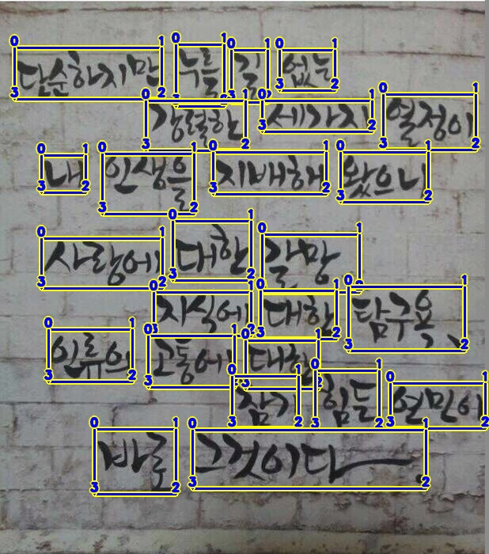
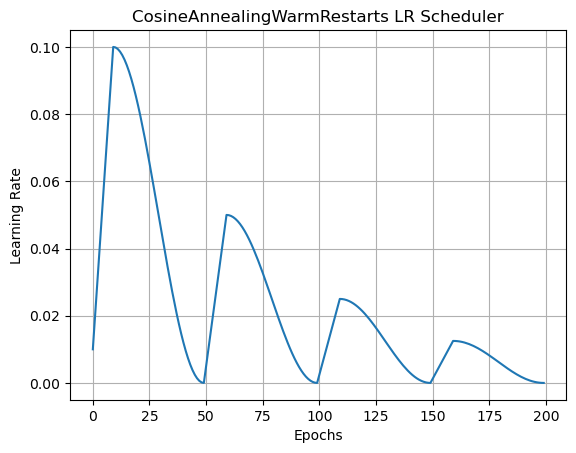

# BoostCamp AI Tech4 level-2-데이터 제작 프로젝트


## Member🔥
| [김지훈](https://github.com/kzh3010) | [원준식](https://github.com/JSJSWON) | [송영섭](https://github.com/gih0109) | [허건혁](https://github.com/GeonHyeock) | [홍주영](https://github.com/archemist-hong) |
| :-: | :-: | :-: | :-: | :-: |
|  |  |  |  |  |
***
## Index
* [Project Summary](#Project-Summary)
* [Team role](#Team-role)
* [Procedures](#Procedures)
* [Model](#model)
* [Result](#result)
* [Command](#Command)
* [Wrap UP Report](#Wrap-UP-Report)  
***


## Project-Summary

- **배경**: AI 모델의 성능은 모델 구조, 데이터, 최적화의 조합으로 결정된다. 이 중 데이터의 중요성에 대해 학습할 수 있도록 모델과 관련한 부분을 수정할 수 없는 Data centric AI competition을 참가하였다.
- **주제**: OCR task 중 글자 검출(text detection) task
- **규칙**: 모델 변경 금지, 학습 데이터 추가 및 수정을 통한 이미지 속 글자 검출 성능 개선 대회
- **Input**: 글자가 포함된 이미지
- **Output:** bbox 좌표가 포함된 json 파일 (Upstage Format for OCR)
- **평가 방법**: DetEval


## Team role
- 김지훈 : Data 실험, albumentation 관련 실험
- 원준식: data 추가 실험, validation score 추가
- 송영섭 : 대회 실험 관리 및 진행, Data 및 augmentation 실험
- 허건혁 : data Visual 개발, data-anootation merge 개발, straug 실험
- 홍주영: Opimization, TTA, Data 관련 실험
---

## Procedures
대회 기간 : 2022.12.08 ~ 2022.12.15 19:00

| 날짜 | 내용 |
| :---: | :---: |
| 12.05 ~ 12.09 | OCR 이론 학습, data annotation 제작 및 수집, 기능 개발
| 12.10 ~ 12.14 | model 실험 및 기능 개발
| 12.14 ~ 12.15 | fine tuning
---
## Model
- Fix
    - model.py 
    - loss.py 
    - east_dataset.py 
    - detect.py

### Data & EDA


- 라벨링
    - 단어 사이의 띄어쓰기 기준
    - 좌상단부터 순서대로 라벨링: mirroring 등 특수한 경우에도 대응 가능
- 수집환경: 실내, 야외를 가리지 않고 다양한 상황에서 수집

- ICDAR과 같은 외부 데이터는 학습에 활용할 수 있도록 UFO format으로 변환 후 사용했다.

### Augmentation

- **Random ratio** **resize img**

1024로 resize 한 뒤에 random ratio로 resize 하고, crop 하는 augmentation을 적용했다.

이 방식을 통해 더 다양한 input을 줄 수 있을 것으로 생각하였고, 일반화 성능이 높아질 것이라 생각했다.

| dataset/epoch | resize | F1 | Recall | Precision |
| --- | --- | --- | --- | --- |
| ICDAR2017_Korean 200e | 1024 | 0.4949 | 0.3901 | 0.6766 |
| ICDAR2017_Korean 200e | 1024 + random ratio | 0.5237 | 0.4183 | 0.7001 |

결과적으로 유의미한 성능 향상이 있다고 판단하여 해당 augmentation을 포함하여 학습시켰다.


### Optimization
- **Adam with Learning scheduler**
    - baseline에 있는 optimization이다. 이번 대회에서 사용한 EAST 모델이 사용한 optimizer이며 learning scheduler는 learning rate 가 max epoch / 2 에서 1/10 로 감소하게 설정되어 있다. 

    - EAST 에서는 learning rate 가 1e-3 부터 시작하여 27400 batch 마다 1/10씩 감소하게 설정되어 있었지만 max epoch 이 정해지지 않아 실험에 쓰기가 어려웠다. 그러므로 논문의 방식을 따르지 않고 baseline 을 그대로 사용하였다.

| dataset | F1 | Recall | Precision | Language | epoch |
| :---: | :---: | :---: | :---: | :---: | :---: |
| ICDAR2017 | 0.4949 | 0.3901 | 0.6766 | Korean | 200 |
| ICDAR2017 | 0.5848 | 0.4943 | 0.7160 | All | 40 |
| ICDAR2017 | 0.5531 | 0.4654 | 0.6814 | Korean,English | 40 |
|ICDAR2017, </br> ICDAR2019 | 0.6339  | 0.5410  | 0.7652  | All | 35 |
| ICDAR2017, </br> ICDAR2019, </br> Camper| 0.6489 | 0.5536 | 0.7864 | All | 40 |
| ICDAR2019 | 0.6543 | 0.5671 | 0.7731 | All | 40 |
| ICDAR2017,</br> ICDAR2019, </br> Camper | 0.6701 | 0.5661 | 0.8207 | All | 60 |
| ICDAR2017,</br> ICDAR2019, </br> Camper | 0.6726 | 0.5791  | 0.8023 | All | 80 |

기존 ICDAR 2017 Korean 데이터 셋을 사용했을 때 보다 모든 언어를 사용한 경우에 성능이 가장 좋았다. 데이터 수가 많으면 좋을 것이라는 생각에 ICDAR 2017 데이터에 ICDAR 2019데이터를 함께 사용한 경우 성능이 더 좋았다. 추가적으로 boost camp의 캠퍼들이 직접 라벨링 한 데이터를 포함시켰을 때 더 좋은 성능을 보여줬고, 오랫동안 학습을 시킨 경우 미미하지만 지속적으로 성능 향상이 있었다.

batch size는 12 → 24로 키웠을 때 더 빠른 속도로 학습할 수 있었으며, 유의미한 성능 향상도 있었다.

- **Custom Cosine Warm up Restart Scheduler**
    - cosine annealing scheduler에 warm up 단계 추가
    - 반복되는 주기마다 learning rate 줄임

실험 결과 기존 multi-step lr scheulder를 사용했던 baseline에 비해 F1 score가 향상되는 유의미한 결과를 얻을 수 있었다.

|  | F1 | Recall | Precision | max_lr |
| :---: | :---: | :---: | :---: | :---: |
| baseline | 0.4571 | 0.3527 | 0.6496 |  |
| warmup cos annealing | 0.5120 | 0.4008 | 0.7085 | 0.001 |

---
## Result

- ICDAR 2019 데이터만 활용하여 40epoch를 돌렸을 때, 다른 데이터를 이용하여 실험한 결과보다 좋게 나왔으며, Wandb를 이용했을 때 loss 값이 계속 줄어들고 있다는 것을 확인 후 10,000장을 학습 시키기 위해 더 많은 epoch이 필요하다고 판단
- 이때까지 진행한 실험 중 가장 결과가 좋았던 ICDAR 2019 데이터 + batch_size 24 + Random ratio resize img + epoch145을 제출

| Leaderboard | 대회진행 | 최종 |
| --- | --- | --- |
| Score(f1 score) | 0.6806 | 0.7174 |
| Ranking | 8th / 19th | 3th / 19th |

## Command

- Train
```
python train.py
```

- Data Visual을 위한 streamlit command
```
streamlit run visual.py
```

---
## Wrap UP Report
- [Report](https://www.notion.so/howmuchisit/Wrap-Up-ad0252e00e8a4347bbdcf258c356ce39)
